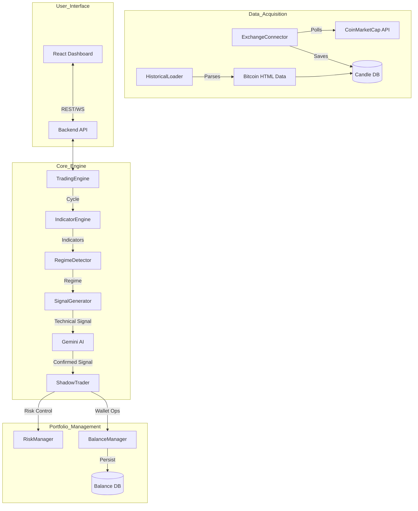

# AGENTS.md

## Project Goal
The **Adaptive Trading System** aims to provide a robust, AI-enhanced platform for multi-regime quantitative trading. It allows users to simulate and execute various trading strategies across multiple risk profiles (Shadow Portfolios) simultaneously, using real-time market data and AI-driven sentiment analysis to optimize performance in changing market conditions.

## System Overview & Processes

### Process Notes & Known Issues
- **Bottle Neck**: `RegimeDetector` and `SignalGenerator` rely on sequential Gemini AI calls which can introduce latency if many modes are active.
- **Data Gap**: Historical data parsing from HTML is regex-based and may fail if the HTML structure changes significantly.
- **Bug Alert**: Trailing stop logic currently uses a hardcoded 1% threshold; should be configurable in the future.

## Current State
The project has a fully functional backend engine capable of shadow trading across 6 risk modes. The UI features a modernized wallet dashboard and granular position management.

### Recently Completed Tasks
- [x] Modernized Wallet UI with equity visualization.
- [x] Implemented leverage adjustment for open positions.
- [x] Refined `shotgun` and `chasing_dragons` strategies.
- [x] Added hourly Market Data service (Fear/Greed, News, Market Cap).
- [x] Integrated per-mode fund return toggle (Main vs. Bot).
- [x] Implemented automatic historical data loading from root HTML.

### TODO List
- [ ] Implement real-time news sentiment weight in `RegimeDetector`.
- [ ] Add more granular backtest reporting (Sharpe Ratio, Max Drawdown duration).
- [ ] Support custom indicator parameters via UI.
- [ ] Integrate real exchange API for live (non-shadow) trading.

## Context Material
Additional project context, design docs, and external resources can be found in:
`documentation/context/`

## Instructions for Agents
1. **Always Update Documentation**: Before notifying the user of a task completion, you **MUST** update this `AGENTS.md` file and any relevant files in `documentation/`.
2. **In-place Editing**: Modify the existing text in `AGENTS.md` to reflect the current state (e.g., move items from TODO to Recently Completed), rather than appending to the end of the file.
3. **Mermaid Accuracy**: Ensure the process diagram stays aligned with any architectural changes you make.
