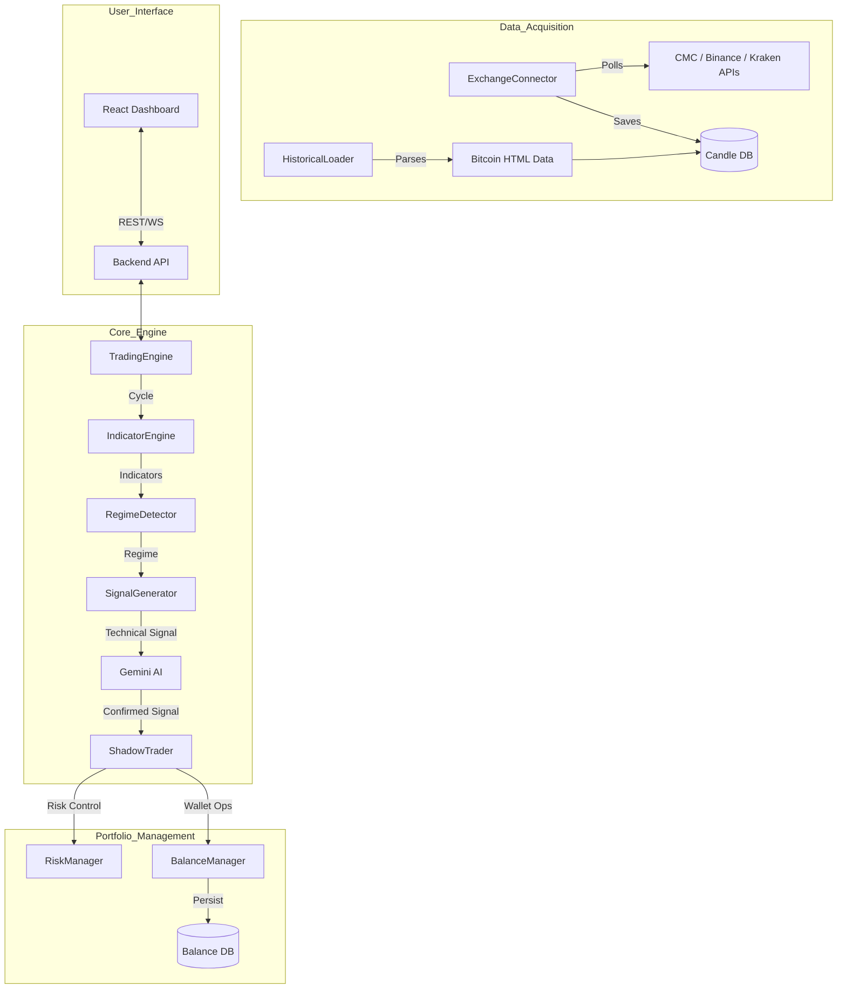

# AGENTS.md

## Project Goal
The **Adaptive Trading System** aims to provide a robust, AI-enhanced platform for multi-regime quantitative trading. It allows users to simulate and execute various trading strategies across multiple risk profiles (Shadow Portfolios) simultaneously, using real-time market data and AI-driven sentiment analysis to optimize performance in changing market conditions.

## System Overview & Processes

### Process Notes & Known Issues
- **Bottle Neck**: `RegimeDetector` and `SignalGenerator` rely on sequential Gemini AI calls which can introduce latency if many modes are active.
- **Data Gap**: Historical data parsing from HTML is regex-based and may fail if the HTML structure changes significantly.
- **Bug Alert**: Trailing stop logic currently uses a hardcoded 1% threshold; should be configurable in the future.

## Current State
The project has a fully functional backend engine capable of shadow trading across 6 risk modes. The UI features a modernized wallet dashboard and granular position management.

### Recently Completed Tasks
- [x] Aligned trading logic with `build_logic.md` v2.0 specifications.
- [x] Implemented weighted scoring system for regime-specific strategies.
- [x] Added advanced features: Multi-candle holds, Runner positions, Trailing stops.
- [x] Updated Risk Manager with MD-compliant leverage and position sizing.
- [x] Enhanced AI Regime Analysis with shadow performance context.
- [x] Implemented comprehensive circuit breakers (consecutive losses, volatility spikes).
- [x] Completed a senior code review and published findings in `documentation/code_reviews/2026-04-22-code-review.md`.
- [x] Added API token authentication middleware for privileged backend endpoints and bounded historical query limits.
- [x] Conducted a high-level system appraisal and published `documentation/current_state_and_recommendations.md` with system health, feature inventory, config status, and next-step roadmap.
- [x] Appraised and stabilized automated tests; expanded `npm test` scope to all test suites and restored green test status.
- [x] Implemented endpoint-level role authorization (`admin` / `trader`) with token fallback support and fail-closed production behavior.
- [x] Added request validation guards for mutating API routes (payload type/shape/range checks).
- [x] Removed hardcoded exchange API key usage; exchange credentials now load from env/settings with startup validation.
- [x] Added route-level authorization test coverage (401/403/503 matrix) and adopted Zod-based payload schemas for mutating routes.
- [x] Added startup/health diagnostics endpoints and explicit scheduler lifecycle controls (`startSchedulers` / `stopSchedulers`).
- [x] Added quality-gate automation (coverage, complexity, audit scripts + CI workflow scaffold).
- [x] Added market/news circuit-breaker fallback to cached data with basic fetch/circuit metrics.
- [x] Added structured JSON logging with request correlation IDs (`x-request-id`) across API/runtime paths.
- [x] Expanded exchange connector market-data provider support (CoinMarketCap + Binance + Kraken) and surfaced startup provider capabilities diagnostics.
- [x] Raised baseline coverage quality-gate thresholds incrementally (42% lines / 61% branches).
- [x] Added API request telemetry (latency/error-rate + slow-route summaries) to diagnostics health output.
- [x] Expanded exchange connector authenticated execution via typed provider adapters (Binance + Kraken).
- [x] Raised baseline coverage quality-gate thresholds incrementally (43% lines / 61% branches).
- [x] Implemented real-time news sentiment weighting in `RegimeDetector` confidence/regime outputs.
- [x] Drastically expanded automated test coverage (exchange adapters, risk-manager branches, news-sentiment weighting, metrics reset paths), raising total coverage to ~51% lines / ~68% branches.
- [x] Removed hardcoded CoinGecko demo key fallback from `MarketDataService`; API key now resolves from env/constructor input only.
- [x] Refactored `OptimizationEngine` for dependency injection (`queryFn` + AI client factory), safer AI JSON handling, and near-complete unit coverage.
- [x] Further expanded automated test coverage for market-data resiliency and optimization workflow branches, raising total coverage to ~56% lines / ~69% branches.
- [x] Added Prometheus-style diagnostics metrics output at `GET /api/diagnostics/metrics` (API + market-data counters/latency gauges).
- [x] Expanded test coverage for indicator calculation and strategy signal-generation branches, raising total coverage to ~61% lines / ~70% branches.
- [x] Ratcheted quality-gate default coverage thresholds to 50% lines / 65% branches.
- [x] Added focused engine utility and logger helper tests (`trading_engine_methods`, `logger`) and improved observed coverage to ~61.8% lines / ~70.6% branches.
- [x] Added cross-platform shortcut launcher script (`npm run bot:launch`) for Windows/macOS/Ubuntu/Arch/Fedora/Linux plus Android/iOS shell runtimes with target/mode flags.

### TODO List
- [ ] Continue raising quality-gate thresholds toward target policy (coverage and complexity) as test breadth grows.
- [ ] Expand exchange connector abstraction for additional authenticated providers beyond Binance/Kraken (e.g., OKX).
- [ ] Push automated coverage toward stretch goal (95% long-term) by adding deep route/main/shadow deterministic tests.

## Context Material
Additional project context, design docs, and external resources can be found in:
`documentation/context/`

## Instructions for Agents
1. **Always Update Documentation**: Before notifying the user of a task completion, you **MUST** update this `AGENTS.md` file and any relevant files in `documentation/`.
2. **In-place Editing**: Modify the existing text in `AGENTS.md` to reflect the current state (e.g., move items from TODO to Recently Completed), rather than appending to the end of the file.
3. **Mermaid Accuracy**: Ensure the process diagram stays aligned with any architectural changes you make.
