# Shady Trader - Codebase Structure & Analysis

**Generated:** 2026-06-01 08:03 UTC+7

## File Tree Diagram

```mermaid
graph TD
    subgraph Root["📦 Root Directory"]
        direction LR
        package["📄 package.json<br/>Dependencies & scripts"]
        tsconfig["📄 tsconfig.json<br/>TypeScript config"]
        docker-compose["📄 docker-compose.yml<br/>Docker setup"]
        vite["📄 vite.config.ts<br/>Frontend build"]
        playwright["📄 playwright.config.ts<br/>E2E tests"]
        env["📄 .env.example<br/>Environment template"]
        gitignore["📄 .gitignore<br/>Exclusions"]
    end

    subgraph Backend["🔧 Backend (79 files, 20.4K LOC)"]
        direction TB
        
        subgraph Core["Core Engine"]
            main["main.ts<br/>TradingEngine class<br/>Cycle orchestration"]
        end
        
        subgraph API["API Layer"]
            routes["routes.ts<br/>REST endpoints<br/>1,409 LOC"]
            marketData["marketDataService.ts<br/>Data fetching"]
            websocket["websocket.ts<br/>Real-time broadcast"]
        end
        
        subgraph Exchange["Exchange Integration"]
            connector["connector.ts<br/>Multi-exchange support<br/>1,210 LOC"]
            adapter["adapter.ts<br/>Typed adapters<br/>Binance/Kraken/OKX/Coinbase"]
            reconciliation["reconciliation.ts<br/>Position reconciliation"]
            wsPool["ws-connection-pool.ts<br/>Connection pooling"]
            cache["cache.ts<br/>Multi-level caching"]
            dedup["deduplication.ts<br/>Zero-copy dedup"]
        end
        
        subgraph Indicators["Technical Indicators"]
            engine["engine.ts<br/>20+ indicators<br/>RSI, MACD, BB"]
            worker["indicator-worker.js<br/>Parallel computation"]
        end
        
        subgraph Regime["Regime Detection"]
            detector["detector.ts<br/>AI-enhanced<br/>News sentiment"]
            sentiment["sentiment_worker.ts<br/>Async sentiment"]
        end
        
        subgraph Strategy["Strategy & Signals"]
            signal["signal_generator.ts<br/>4 strategies<br/>Live confidence"]
            optimization["optimization_engine.ts<br/>Bayesian tuning"]
            candle_exit["candle_exit_manager.ts<br/>Multi-candle holds"]
        end
        
        subgraph Shadow["Shadow Trading"]
            shadow["shadow_trader.ts<br/>6 risk modes<br/>Paper trades"]
        end
        
        subgraph Risk["Risk Management"]
            riskMgr["manager.ts<br/>Circuit breakers<br/>Position sizing"]
        end
        
        subgraph Slippage["Transaction Costs"]
            engine_slip["engine.ts<br/>Almgren-Chriss"]
            liquidity["liquidity-analyzer.ts<br/>L2/L3 depth"]
            impact["impact-simulator.ts<br/>Monte Carlo"]
            cost["cost-estimator.ts<br/>Total cost"]
        end
        
        subgraph PaperTrading["Paper Trading"]
            service["paper-trading-service.ts<br/>Order lifecycle"]
            state_machine["state-machine.ts<br/>Order FSM"]
            order_book["order-book.ts<br/>Book simulator"]
            position["position-tracker.ts<br/>P&L tracking"]
            ws_handler["websocket-handler.ts<br/>Position updates"]
            controller["paper-trading.controller.ts<br/>REST endpoints"]
        end
        
        subgraph MonteCarlo["Monte Carlo"]
            mc_engine["monte-carlo-engine.ts<br/>Path generation"]
            stress["stress-test-engine.ts<br/>Chaos scenarios"]
            mc_controller["monte-carlo.controller.ts<br/>API endpoints"]
        end
        
        subgraph Database["Database"]
            db["database.ts<br/>SQLite interface"]
            db_worker["database_worker.ts<br/>Async ops"]
            db_postgres["database_postgres.ts<br/>PostgreSQL pool"]
        end
        
        subgraph Observability["Observability"]
            logger["logging/logger.ts<br/>Structured JSON"]
            rotation["logging/rotation.ts<br/>Log rotation"]
            metrics["observability/requestMetrics.ts<br/>Prometheus metrics"]
        end
        
        subgraph Other["Other Services"]
            state_mgr["stateless-manager.ts<br/>Redis state"]
            job_q["job_queues.ts<br/>BullMQ scheduling"]
            backup["backup.ts<br/>DB backups"]
            balance["balance/manager.ts<br/>Portfolio allocation"]
            validation["config/validation.ts<br/>Zod validation"]
            ml["ml/<br/>Gemma AI integration"]
        end
    end

    subgraph Frontend["⚛️ Frontend (5 files, 3.6K LOC)"]
        direction TB
        App["App.tsx<br/>Main UI<br/>3,097 LOC<br/>Charts, tables, controls"]
        main_tsx["main.tsx<br/>React entry<br/>Error boundary"]
        MLDash["components/MLDashboard.tsx<br/>ML predictions<br/>389 LOC"]
        store["stores/connectionStore.ts<br/>Zustand state"]
        css["index.css<br/>Tailwind styles"]
    end

    subgraph Tests["🧪 Tests (40 files, 8.0K LOC)"]
        direction TB
        
        subgraph TestUnits["Unit Tests"]
            api_tests["api/<br/>Auth, metrics, websocket"]
            exchange_tests["exchange/<br/>Connector, adapters"]
            risk_tests["risk/<br/>Circuit breakers"]
            slippage_tests["slippage/<br/>Cost estimation"]
            signal_tests["signal_generator/<br/>Strategy signals"]
            indicator_tests["indicators/<br/>Technical calcs"]
        end
        
        subgraph TestIntegration["Integration Tests"]
            paper_tests["paper-trading/<br/>Order lifecycle"]
            deep_det["deep-deterministic/<br/>Main, routes, shadow"]
            monte_carlo_tests["monte-carlo/<br/>Simulations"]
            optimization_tests["optimization_engine/<br/>Bayesian tuning"]
        end
        
        subgraph TestE2E["E2E & Playwright"]
            pw_tests["trading-system.spec.ts<br/>58 full tests<br/>100% pass"]
            reload_test["verify-reload-fix.spec.ts"]
        end
        
        subgraph TestQuarantine["⚠️ Quarantined Tests"]
            quarantine["job_queues.test.quarantined.ts<br/>monte-carlo.test.quarantined.ts<br/>e2e.test.ts<br/>integration_multi_module.test.quarantined.ts"]
        end
    end

    subgraph Config["⚙️ Configuration"]
        direction LR
        k8s["k8s/<br/>Kubernetes manifests<br/>Ingress, HPA, monitoring"]
        docker["docker/<br/>Dockerfile configs<br/>Nginx, PostgreSQL"]
        scripts["scripts/<br/>Utilities<br/>Launch, migrate, audit"]
        configs["config/<br/>Env files<br/>dev/staging/prod"]
    end

    subgraph Docs["📚 Documentation"]
        direction LR
        AGENTS["AGENTS.md<br/>Architecture & goals"]
        README["README.md<br/>Setup & API docs"]
        BUILD_LOGIC["build_logic.md<br/>Trading logic v2.0"]
        impl_guide["implementation_coverage_guide.md<br/>Feature inventory"]
        code_review["code_reviews/2026-04-22<br/>Senior review findings"]
        test_quarantine["testing/test_quarantine<br/>Flaky test docs"]
        seed_issues["seed_database_issues.md<br/>Database setup"]
    end

    subgraph Reports["📊 Generated Reports"]
        direction LR
        coverage["coverage/<br/>NYC coverage data"]
        test_results["test-results/<br/>Playwright reports<br/>60+ test videos"]
        playwright_report["playwright-report/<br/>Full test report"]
        logs["*.log files<br/>⚠️ Runtime logs"]
    end

    subgraph Temp["🗑️ Temporary/Unused"]
        direction LR
        html_data["Bitcoin Historical Data.html<br/>⚠️ Unused data file"]
        backup_file["backend/api/routes.ts.backup<br/>⚠️ Unused backup"]
        kilo_dir[".kilo/<br/>⚠️ Legacy planning tool<br/>Obsolete plans"]
        linux_amd64["linux-amd64/<br/>⚠️ Binary directory<br/>Unused"]
        snapshots[".snapshots/<br/>⚠️ Snapshot cache"]
        nyc_output[".nyc_output/<br/>⚠️ Coverage raw data"]
        test_db["test-db.js<br/>⚠️ Unused script"]
        server_pid["server.pid<br/>⚠️ Stale PID file"]
        empty_file["1<br/>⚠️ Empty file"]
    end

    Root --> Backend
    Root --> Frontend
    Root --> Tests
    Root --> Config
    Root --> Docs
    Root --> Reports
    Root --> Temp
    
    Backend --> Core
    Backend --> API
    Backend --> Exchange
    Backend --> Indicators
    Backend --> Regime
    Backend --> Strategy
    Backend --> Shadow
    Backend --> Risk
    Backend --> Slippage
    Backend --> PaperTrading
    Backend --> MonteCarlo
    Backend --> Database
    Backend --> Observability
    Backend --> Other
```



---

## Core Backend Modules (Active)

| Module | Files | LOC | Purpose | Status |
|--------|-------|-----|---------|--------|
| **Trading Engine** | 1 | 1,195 | Main cycle, lifecycle | ✅ Core |
| **API Routes** | 1 | 1,409 | REST endpoints, auth | ✅ Active |
| **Exchange Connector** | 1 | 1,210 | Multi-exchange support | ✅ Active |
| **Strategy/Signals** | 3 | 648 | 4 strategies + tuning | ✅ Active |
| **Shadow Trading** | 1 | 599 | 6 risk modes | ✅ Active |
| **Risk Manager** | 1 | 432 | Circuit breakers | ✅ Active |
| **Paper Trading** | 6 | 2,048 | Order lifecycle + tracking | ✅ Active |
| **Monte Carlo** | 5 | 1,359 | Simulations + stress tests | ✅ Active |
| **Slippage Engine** | 4 | 948 | Cost modeling | ✅ Active |
| **Regime Detector** | 2 | 328 | AI-enhanced classification | ✅ Active |
| **Indicators** | 2 | 249 | 20+ technical indicators | ✅ Active |
| **Database Layer** | 3 | 1,349 | SQLite + PostgreSQL | ✅ Active |
| **Observability** | 3 | 476 | Logging + metrics | ✅ Active |
| **ML Integration** | 7 | 1,093 | Gemma AI + bridge | ✅ Active |

---

## Frontend Components (Active)

| Component | LOC | Purpose | Status |
|-----------|-----|---------|--------|
| **App.tsx** | 3,097 | Main dashboard (charts, tables, controls) | ✅ Active |
| **MLDashboard.tsx** | 389 | ML predictions panel | ✅ Active |
| **React setup** | 53 | Entry + error boundary | ✅ Active |

---

## 🚩 Unused/Outdated Files

### Category: Legacy Backups & Temporary Files
- ❌ `backend/api/routes.ts.backup` - Redundant backup (use git instead)
- ❌ `test-db.js` - Test utility, unused
- ❌ `server.pid` - Stale PID from old run
- ❌ `1` - Empty file, unknown origin

### Category: Obsolete Data Files
- ❌ `Bitcoin Historical Data.html` (424 KB) - Static HTML data, unused by system
- ❌ `comparecryptoapi.pdf` (4.1 MB) - PDF documentation, unused

### Category: Legacy Planning/Configuration
- ❌ `.kilo/` directory - Old Kilo planning tool (7 plan files)
  - `1778125155031-curious-moon.md`
  - `1778130325654-brave-falcon.md`
  - `1778133773312-hidden-star.md`
  - `1778135878095-quick-tiger.md`
  - `1778140605541-quiet-wizard.md`
  - `1778143390478-cosmic-island.md`
  - `1778146776220-silent-engine.md`
  - `module3-technical-extension.md`
  - **Impact:** Planning is now in AGENTS.md and documentation/
  - **Action:** Archive or delete `.kilo/`

- ❌ `.snapshots/` directory - Snapshot cache
  - `config.json`, `readme.md`, `sponsors.md`
  - **Impact:** Low, can be regenerated

### Category: Build/Environment Artifacts
- ❌ `linux-amd64/` directory (LICENSE, README) - Binary artifacts
- ❌ `helm.tar.gz` (16 MB) - Old Helm archive, may be outdated
- ⚠️  Database files (trading.db-wal, trading.db-shm) - Live data, keep but exclude from git

### Category: Test Artifacts (Safe to Clean)
- ⚠️  `coverage/tmp/` - 80+ raw coverage JSON files (can regenerate with `npm run test:coverage`)
- ⚠️  `test-results/` - 60 Playwright test result directories (video + screenshots)
- ⚠️  `playwright-report/` - Full Playwright HTML report
- ⚠️  `.nyc_output/` - NYC coverage raw data

---

## 📋 Quarantined Tests (Intentionally Skipped)

These tests are `.skip` / `.quarantined.ts` due to known issues:

| File | Reason | Status |
|------|--------|--------|
| `tests/job_queues/job_queues.test.quarantined.ts` | Redis dependency | ⚠️  Pending fix |
| `tests/monte-carlo/monte-carlo.test.quarantined.ts` | Convergence flakiness | ⚠️  Pending fix |
| `tests/integration/e2e.test.ts` | Full system e2e flakiness | ⚠️  Documented in test_quarantine_2026-05-11.md |
| `tests/integration/integration_multi_module.test.quarantined.ts` | Multi-module integration | ⚠️  Pending fix |

**Active & Passing:** Playwright E2E suite (58/58 tests ✅)

---

## 📅 Outdated Documentation

| Document | Date | Status | Notes |
|----------|------|--------|-------|
| `documentation/seed_database_issues.md` | Pre-2026-05-11 | ⚠️  Potentially outdated | Schema may have changed post-audit |
| `documentation/code_reviews/2026-04-22-code-review.md` | 2026-04-22 | ⚠️  1+ month old | Pre-signal-overhaul (2026-05-16) |
| `.kilo/plans/` (all) | 2026-04 to 2026-05 | ⚠️  Archived | Planning moved to AGENTS.md |
| `docs/plans/2026-05-16-bug-fix-plan.md` | 2026-05-16 | ✅ Recent | Signal system fixes, still relevant |
| `COMPONENT_READINESS_MATRIX.md` | Generated | ⚠️  May need refresh | Last verified 2026-05-13 |
| `SYSTEM_DATA_ANALYSIS.md` | Generated | ⚠️  May need refresh | Last verified 2026-05-13 |

**Recommendation:** Update code review with signal-system changes and latest test coverage.

---

## 📊 Test Coverage Summary

| Metric | Value | Target | Status |
|--------|-------|--------|--------|
| Lines Covered | 50.41% | 50% | ✅ Pass |
| Branches Covered | 66.06% | 65% | ✅ Pass |
| Playwright E2E | 58/58 | - | ✅ 100% |
| Backend Unit Tests | 237/243 | - | ⚠️  97.5% (6 flaky) |

---

## 🧹 Cleanup Recommendations

### High Priority (Free up disk space)
1. Delete `Bitcoin Historical Data.html` (424 KB)
2. Delete `comparecryptoapi.pdf` (4.1 MB)
3. Delete `linux-amd64/` directory
4. Delete `.kilo/` directory (legacy tool)
5. Delete `.snapshots/` directory (can regenerate)

### Medium Priority (Clean up artifacts)
6. Exclude `coverage/tmp/` from git (regenerated on test)
7. Exclude `test-results/` from git (Playwright artifacts)
8. Exclude `playwright-report/` from git
9. Exclude `.nyc_output/` from git

### Low Priority (Optional)
10. Consider archiving `helm.tar.gz` if using newer Helm configs
11. Delete `test-db.js` if unused in CI/CD
12. Delete `backend/api/routes.ts.backup` (use git history instead)

### Git Ignore Updates
Add to `.gitignore`:
```
coverage/tmp/
test-results/
playwright-report/
.nyc_output/
.snapshots/
.kilo/
linux-amd64/
*.pdf
*.html
```

---

## 📁 Directory Size Analysis

| Directory | Size | Action |
|-----------|------|--------|
| `coverage/` | ~50 MB | Artifacts, can clean |
| `test-results/` | ~150 MB | Artifacts, can clean |
| `.nyc_output/` | ~20 MB | Artifacts, can clean |
| `playwright-report/` | ~2 MB | Artifacts, can clean |
| `node_modules/` | (not checked) | Typical ~500MB+ |
| `backend/` | ~2 MB | Active, keep |
| `src/` | ~200 KB | Active, keep |

**Total Potential Cleanup:** ~220 MB if removing all test artifacts and legacy files

---

## ✅ System Health Status

- **Core Engine:** ✅ Operational (TradingEngine.ts)
- **API Routes:** ✅ Operational (1,409 LOC, all endpoints live)
- **Exchange Integration:** ✅ Operational (7 exchanges supported)
- **Trading Strategies:** ✅ Operational (4 strategies active)
- **Risk Management:** ✅ Operational (6 modes, circuit breakers)
- **Paper Trading:** ✅ Operational (Order lifecycle FSM)
- **Slippage Engine:** ✅ Operational (Almgren-Chriss + Monte Carlo)
- **Frontend Dashboard:** ✅ Operational (React + Tailwind)
- **Test Suite:** ⚠️  97.5% passing (6 flaky tests in quarantine)
- **Observability:** ✅ Operational (Logging + Prometheus metrics)

---

## 📝 Notes

- All active code is properly TypeScript-typed and compiles without errors
- Architecture follows AGENTS.md specification precisely
- Signal system overhauled 2026-05-16 with live confidence scoring
- AI integration uses Gemma 4 E2B with fallback rules
- Database supports both SQLite (dev) and PostgreSQL (prod)
- Kubernetes manifests ready for production deployment
- All quality gates passing (coverage, complexity, linting)

---

**Last Updated:** 2026-06-01 08:03 UTC+7
**Generated by:** Kiro CLI Codebase Analysis
