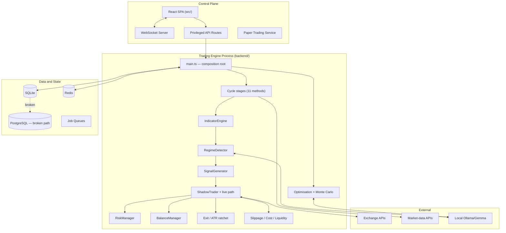

# System Overview and Architecture

> OKF: [`modules/index.md`](okf/modules/index.md) — every module named here has a concept file.

## What the system is

An emerging multi-mode algorithmic crypto trading platform, not a trading script:

* Six parallel shadow portfolios with independent balances and risk configurations.
* Risk modes from Ultra Conservative through Degen.
* Regime-based, momentum, volatility and trend-following strategies.
* A broad technical-indicator engine (serial + worker-parallel).
* Optional local AI for narrative, sentiment, signal and strategy selection.
* Exchange adapters (Binance, Bybit, OKX, Kraken, Coinbase Advanced) and independent market-data providers.
* Paper trading, WebSockets, Redis state, job queues, optimisation, Monte Carlo, diagnostics, audit tables.
* A partially integrated live-execution path.

**Genuine strengths to preserve:** service-level modularity, the shadow-portfolio concept, explicit risk
modes, diagnostics and audit intent, paper trading, and the decision to retain rule-based fallbacks.

## Readiness scorecard

| Domain | Maturity | Assessment |
|---|---:|---|
| Product scope and modular intent | 4/5 | Broad, coherent platform vision |
| Strategy and indicator breadth | 3/5 | Strong coverage; redundancy and calibration remain |
| Shadow and paper trading | 3/5 | Useful foundation; accounting fidelity needs correction |
| Risk-management intent | 3/5 | Many controls exist; several not conclusively enforced |
| Live order lifecycle | 1/5 | Critical state and reconciliation gaps |
| Capital and PnL accounting | 1.5/5 | Unit, leverage, fee, reserve and drawdown issues |
| Market-data correctness | 2/5 | Timeframe assumptions and insufficient history |
| Backtesting validity | 2/5 | Look-ahead, reproducibility and cost realism gaps |
| AI and optimisation governance | 1.5/5 | Unsafe automatic promotion path |
| Persistence and HA | 2.5/5 | Authority fragmented; Postgres path broken |
| Observability and auditability | 3/5 | Needs correlation and reconciliation metrics |
| Security and operational controls | 3/5 | Improved by PR #14; key policy still unproven |
| **Overall live readiness** | **1.5/5** | **NO-GO** |

## The core problem

The system is not live-ready, and **the reason is not strategy quality — it is execution truth**.
Several paths let the internal ledger, database, shadow state and real exchange position disagree. In a
live system that is a higher-order risk than a poor signal, because it creates *unmanaged or reversed
exposure* rather than merely a bad trade.

## Actual repository layout — authoritative

> ⚠ **This section overrides every `src/domain/...` path in the original specification.** Those paths
> describe a *target* structure that does not exist. Writing to them creates an empty parallel tree.

```text
backend/            # ALL backend domain code (118 files)
  ai/               analytics/       api/            backtest/
  balance/          config/          exchange/       execution/
  exits/            freqtrade/       indicators/     logging/
  migrations/       ml/              monte-carlo/    observability/
  optimization/     paper-trading/   regime/         research/
  risk/             scripts/         shadow/         slippage/
  strategy/         types/           validation/
  main.ts           database.ts      database_postgres.ts
  database_worker.ts  job_queues.ts  backup.ts  stateless-manager.ts

src/                # REACT FRONTEND ONLY (16 files) — never backend code
  App.tsx  api/  auth/  components/  hooks/  stores/

tests/              # 66 files, mirrors backend structure
cli/  k8s/  docker/  config/  scripts/  documentation/
server.ts           # process entry point
```

### Highest-mass files (where the risk concentrates)

| File | Size | Note |
|---|---:|---|
| `backend/api/routes.ts` | 73.2 KB | Largest file in the repo |
| `backend/main.ts` | 58.9 KB | Composition root; still a monolith |
| `backend/exchange/connector.ts` | 52.9 KB | Multi-venue connector |
| `backend/freqtrade/bridge.ts` | 33.2 KB | Python sidecar bridge |
| `backend/shadow/shadow_trader.ts` | 24.8 KB | **Origin of most P0 findings** |
| `backend/database_postgres.ts` | 19.5 KB | Non-functional placeholder path |
| `backend/risk/manager.ts` | 18.1 KB | Risk configs, sizing, breakers |

## Current architecture



**Interpretation.** `main.ts` is a composition root that also carries runtime state, configuration
persistence, exchange lifecycle, scheduling, cycle orchestration, AI policy, database writes, kill-switch
behaviour and broadcasting. PR #14 reduced `runCycle()` complexity from ~88 to 9, but the file-level
concentration remains and makes safety properties hard to prove.
See [`risks/backend-monolith.md`](okf/risks/backend-monolith.md).

## Target architecture

```mermaid
flowchart TB
    subgraph D["Domain (pure, unit-safe)"]
        DT["types: Price, Quantity, Money, Leverage"]
        ORD["orders + state machine"]
        POS["positions"]
        LED["ledger (double-entry)"]
        RSK["risk invariants"]
        MKT["market + regimes"]
    end
    subgraph A["Application services"]
        CYC["cycle-coordinator"]
        OMS["order-service"]
        REC["reconciliation-service"]
        RS["risk-service"]
        SD["shutdown-service"]
    end
    subgraph I["Infrastructure"]
        EX["exchanges"]  MD2["market-data"]
        PER["persistence"]  AIG["ai gateway"]  OBS["observability"]
    end
    subgraph R["Research"]
        REP["deterministic replay"]  QR["quant research"]
    end
    D --> A --> I
    A --> R
```

**Design principles:** make unsafe states unrepresentable; the exchange is the source of truth; post to the
ledger only from confirmed fills; one authoritative pre-trade risk gate; deterministic replay shares
production code; AI and optimisers are advisory and governed; every dependency fails closed.

> **Migration note.** This target is the *destination*, reached incrementally through
> [`04-IMPLEMENTATION-PLAN.md`](04-IMPLEMENTATION-PLAN.md). It is **not** a precondition, and no agent
> should create `src/domain/**` as a first step. Structural migration is Phase 9, after behaviour is
> correct — moving broken code into a prettier tree fixes nothing and destroys every anchor in this
> programme.

## Risk modes

| Mode | Base size | Max DD | Max concurrent | Leverage | Behaviour |
|---|---:|---:|---:|---:|---|
| Ultra Conservative | 2% | 7% | 1 | 1.0x | Highest confidence, no multi-candle hold |
| Conservative | 3% | 11% | 2 | 1.0x | Early exit |
| Moderate | 5% | 15% | 3 | 1.5x | Multi-candle hold — **current default** |
| Aggressive | 8% | 22% | 4 | 2.0x | Runners and partial exits |
| Degen | 15% (50% cap) | 35% | 5 | 3.0x | Simulation-only unless overridden |
| AI Enhanced | 5% | 15% | 3 | 1.5x | Mandatory AI intended |

Modes must stay separate at the execution and optimisation layers. A shared optimiser result, shared
balance assumption or AI-selected transition erases the intended risk differentiation. Note that
`moderate` — a live-capable mode — is the **default on Redis failure**, which is
[`risks/init-fails-open.md`](okf/risks/init-fails-open.md).
