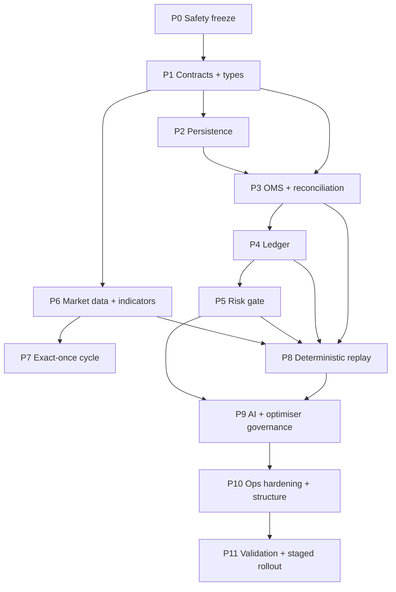

# Phased Implementation Plan

Eleven phases. Every phase names its **OKF concepts**, its **gap IDs**, its **real write paths** and
**objectively checkable exit criteria**.

> **Path warning.** All paths below are the *actual* repository layout (`backend/**`). The `src/domain/**`
> tree in the original specification does not exist — `src/` is the React frontend. Structural migration
> to that target is **Phase 9**, after behaviour is correct.

## Dependency graph

---

## Phase 0 — Freeze and prove safety boundaries
**OKF:** [`simulated-capital-sizing`](okf/risks/simulated-capital-sizing.md), [`startup-state-destruction`](okf/risks/startup-state-destruction.md), [`ai-unbounded-authority`](okf/risks/ai-unbounded-authority.md), [`optimiser-unbounded-authority`](okf/risks/optimiser-unbounded-authority.md), [`ci-red-on-main`](okf/risks/ci-red-on-main.md)
**Gaps:** G-009, G-012, G-013, G-007 (partial) · **Owner:** `security` · **Paths:** `backend/main.ts`, `backend/ml/`, `backend/optimization/`, `.github/workflows/`

1. Disable live order submission by default; introduce an explicit `liveArmed` flag defaulting to `false`.
2. Disable the Degen live override in deployed environments.
3. Disable AI mode switching and automatic optimiser promotion.
4. Remove the automatic full-balance allocation at `backend/main.ts:697-700`.
5. Remove the automatic shadow reset at `backend/main.ts:692`.
6. Add a startup banner and health field exposing `liveArmed=false`.
7. Add transaction-safe database backup (SQLite backup API or `VACUUM INTO`, not a raw file copy).
8. **Re-run CI and capture fresh logs for G-076.** Triage the pre-existing `test`/`quality` failures.

**Exit criteria**
- [ ] No code path submits a live order without a deployment flag **and** an operator arming action.
- [ ] Degraded startup is paper-only.
- [ ] Existing open exchange positions are documented and manually reconciled.
- [ ] G-076 root cause identified, with a green pipeline or a written accepted-risk note.

> Phase 0 is the only phase that may proceed while CI is red — diagnosing that is part of its job.

---

## Phase 1 — Domain invariants and typed contracts
**OKF:** [`modules/index.md`](okf/modules/index.md) · **Gaps:** G-030, G-063 · **Owners:** `architecture` → `domain-types` · **Paths:** `backend/types/`, `backend/validation/`, `backend/config/`

1. Enable strict TypeScript; eliminate `any` from trading, risk, order, fill and position code.
2. Introduce unit-safe types: `Price`, `Quantity`, `Fraction`, `Percent`, `Money`, `Leverage`, `TimestampMs`.
   **This directly kills the G-030 class** — `4.0` and `0.04` become different types, not a convention.
3. Canonical schemas for risk config, strategy config, exchange order, fill, position, signal, regime observation.
4. Validate at every external and persistence boundary.
5. ADRs for order lifecycle, ledger authority, configuration authority and reconciliation truth.

**Exit criteria**
- [ ] Invalid units cannot compile or pass validation.
- [ ] No core trading domain code uses `any`.
- [ ] ADRs reviewed and approved **before** any Phase 3+ implementation starts.

---

## Phase 2 — Persistence
**OKF:** [`database-abstraction-leak`](okf/risks/database-abstraction-leak.md) · **Gaps:** G-037…G-040, G-059, G-061 · **Owner:** `database` · **Paths:** `backend/database*.ts`, `backend/migrations/`

1. **Resolve the Postgres placeholder defect** (`database.ts:285-286`, `database_postgres.ts:593-599`) — translate `?` → `$n`, or formally declare Postgres unsupported.
2. Automated placeholder-count tests across every query.
3. Typed repository layer replacing ad-hoc parameter arrays.
4. Single versioned configuration authority; resolve Redis/SQLite disagreement.
5. Awaited CAS/versioned config updates.
6. Retention and compaction for signal/indicator JSON.

**Exit criteria**
- [ ] Every query exercised by integration tests against the **declared supported** backend(s).
- [ ] Placeholder mismatches impossible (test-enforced).
- [ ] Config has exactly one authority with version history.

---

## Phase 3 — Execution truth: OMS and reconciliation
**OKF:** [`exchange-as-side-effect`](okf/risks/exchange-as-side-effect.md), [`no-reconciliation-loop`](okf/risks/no-reconciliation-loop.md), [`shared-state-races`](okf/risks/shared-state-races.md)
**Gaps:** G-001, G-002, G-003, G-014, G-015, G-027, G-029, G-068 · **Owners:** `execution-oms`, `exchange-reconciliation` · **Paths:** `backend/shadow/shadow_trader.ts`, `backend/exchange/`, `backend/execution/`

**The single most important phase.** Cluster C1 is one sequenced workstream — all these gaps live in the
same file and must not be parallelised.

1. `OrderIntent`, `ExchangeOrder`, `Fill`, `Position` entities.
2. Implement the order state machine including mandatory `UNKNOWN`.
3. Immutable idempotency keys; persist **before** submitting.
4. Treat timeouts as `UNKNOWN`, never as failed or filled.
5. Order-status polling plus WebSocket execution reports.
6. Startup reconciliation: open orders, fills since cursor, positions, balances, protection orders.
7. Continuous reconciliation on a defined cadence — **wire the existing `PositionReconciliationEngine`**.
8. Require `reduceOnly` on every close and partial exit.
9. Block internal close until zero or expected residual quantity is confirmed.
10. Route symbol-specific prices; lock position mutation.

**Exit criteria**
- [ ] A network timeout cannot create a duplicate order.
- [ ] A failed close leaves the position open and protected.
- [ ] Reconciliation rebuilds all positions from exchange data and fills.
- [ ] Exchange/internal quantity divergence is **zero** after every reconciliation run.
- [ ] `reduceOnly` present on 100% of close paths (grep-verifiable, currently zero).

---

## Phase 4 — Ledger
**OKF:** [`leveraged-pnl-inversion`](okf/risks/leveraged-pnl-inversion.md) · **Gaps:** G-004, G-028, G-029, G-035, G-036 · **Owner:** `ledger-accounting` · **Paths:** `backend/balance/`, new ledger module

1. Double-entry accounts: cash, reserved margin, position notional, realised PnL, unrealised PnL, fees, funding, transfers.
2. Post **only** from confirmed fills and funding events.
3. **Correct the PnL formula** — contract semantics, not `Δ/leverage` (`shadow_trader.ts:470-483`).
4. Track high-water equity; snapshot start-of-day equity with UTC reset.
5. Reserve collateral for submitted and open orders (closing the G-029 TOCTOU).
6. Rework partial-exit and runner accounting; apply fees, funding and slippage.
7. End-to-end fixtures: long, short, leveraged, partial, liquidated.

**Exit criteria**
- [ ] Ledger PnL matches exchange realised PnL within a defined rounding tolerance.
- [ ] A 3× leveraged round trip produces mathematically correct PnL (regression test for G-004).
- [ ] No order can exceed free collateral.

---

## Phase 5 — Centralised risk gate
**OKF:** [`final-risk-gate-missing`](okf/risks/final-risk-gate-missing.md), [`risk-state-not-persisted`](okf/risks/risk-state-not-persisted.md), [`inert-daily-loss-breaker`](okf/risks/inert-daily-loss-breaker.md)
**Gaps:** G-006, G-010, G-031…G-036, G-041 · **Owner:** `risk-engine` · **Paths:** `backend/risk/manager.ts`

1. Normalise all configuration units (consuming Phase 1 types).
2. Fixed order: scaling → caps → liquidity adjustment → exchange rounding.
3. **Recompute worst-case risk after rounding.**
4. Enforce per-trade risk, gross/net exposure, correlated exposure, symbol exposure, portfolio leverage, daily loss, high-water drawdown, loss-streak cooldown, max orders/positions.
5. **Compute real daily loss from the ledger** — replace the literal zero at `shadow_trader.ts:136`.
6. Include leverage in the dollar-risk cap (`manager.ts:44`).
7. Kelly returns **zero** on negative edge (`manager.ts:374`).
8. Persist loss-streak and cooldown state; fix the `recordWin` ordering bug.
9. Live risk initialisation fails **closed**.

**Exit criteria**
- [ ] Every exchange submission references a stored `RiskDecision`.
- [ ] Property tests show final risk never exceeds configured limits **after rounding**.
- [ ] Restart preserves all circuit-breaker state.
- [ ] The daily-loss breaker demonstrably fires in a test (currently impossible).

---

## Phase 6 — Market data, indicators, regimes
**OKF:** [`starved-history`](okf/risks/starved-history.md), [`parallel-indicator-pipeline`](okf/risks/parallel-indicator-pipeline.md), [`regime-signal-quality`](okf/risks/regime-signal-quality.md), [`no-timeframe-registry`](okf/risks/no-timeframe-registry.md)
**Gaps:** G-016…G-024, G-053, G-056…G-058 · **Owners:** `market-data` → `indicator-validation` → `regime-research` · **Paths:** `backend/indicators/`, `backend/regime/`, `backend/exchange/connector.ts`

**Strictly ordered — G-016 first.**

1. Central timeframe registry; delete the four duplicate maps in `connector.ts`.
2. Fetch maximum required history per feature/regime window (replace the hard-coded 200 at `main.ts:918`).
3. Data-quality checks: monotonic timestamps, no duplicates, expected spacing, gap flags, provenance.
4. Establish the serial indicator implementation as canonical reference.
5. Fix worker warm-up (prepend) and timestamp-based merge.
6. **Assert parallel equals serial** on a fixed corpus.
7. Correct WaveTrend alignment and denominator clamping.
8. Define VWAP anchoring.
9. Exclude unavailable values instead of substituting zero.
10. Calibrate or rename confidence; add regime hysteresis; return `insufficient_history` until bootstrap completes.
11. Derive the market-data job schedule from the timeframe registry.

**Exit criteria**
- [ ] Every feature window maps to real elapsed duration.
- [ ] Serial and parallel indicators match on the corpus.
- [ ] Regime tests cover bull, bear, sideways, high-volatility, gaps and insufficient-history.

---

## Phase 7 — Exact-once cycle
**OKF:** [`exact-once-execution`](okf/risks/exact-once-execution.md) · **Gaps:** G-025, G-026, G-055, G-060 · **Owner:** `execution-oms` · **Paths:** `backend/execution/executionLock.ts`, `backend/main.ts`, `backend/database.ts`

1. Declare each strategy close-only or intrabar.
2. Close-only strategies process one finalised candle exactly once.
3. Deterministic signal idempotency key (replacing `sig-{ts}-{random}`).
4. Unique DB constraint on (symbol, candle_time, strategy).
5. Replace symbol-only locks with scoped leases including candle and strategy.
6. Lock renewal and fencing tokens.
7. Abortable sleep without conflicting timeout.

**Exit criteria**
- [ ] Replaying the same candle produces no duplicate intent.
- [ ] Two engine instances cannot double-submit.

---

## Phase 8 — Deterministic replay
**OKF:** [`backtest-not-production-equivalent`](okf/risks/backtest-not-production-equivalent.md) · **Gaps:** G-046…G-048, G-051, G-052 · **Owner:** `backtest-replay` · **Paths:** `backend/backtest/`, `backend/research/`

1. Use the **same** signal, risk, OMS, fill and ledger code as production.
2. Execute close-based signals at the next eligible event.
3. Lower-timeframe data or a declared OHLC path model for stop/target ordering.
4. Include spreads, fees, slippage, funding, latency, partial fills, minimum notional, lot/tick rounding.
5. Version all data and strategy inputs.
6. Disable nondeterministic AI unless historical snapshots exist.
7. Walk-forward splits and regime-stratified reports.
8. Reproducible run manifests with checksums.

**Exit criteria**
- [ ] Re-running a manifest produces **identical** results.
- [ ] Paper replay and backtest produce equivalent fills for identical events.

---

## Phase 9 — AI, optimiser governance, and structural migration
**OKF:** [`ai-unbounded-authority`](okf/risks/ai-unbounded-authority.md), [`optimiser-unbounded-authority`](okf/risks/optimiser-unbounded-authority.md), [`backend-monolith`](okf/risks/backend-monolith.md)
**Gaps:** G-012, G-013, G-049…G-052, G-054, G-062, G-073 · **Owners:** `ai-governance`, `architecture` · **Paths:** `backend/ml/`, `backend/ai/`, `backend/optimization/`, then repo-wide

1. AI gateway with strict schemas and timeouts; record model, prompt, parameters, response metadata.
2. Restrict AI to advisory actions; deterministic risk-mode transition matrix; Degen never auto-selected.
3. Optimiser output becomes immutable candidates.
4. Validate via replay, walk-forward, Monte Carlo, stress tests; shadow-canary; human approval; atomic promotion; auto-rollback.
5. **Structural migration** — only now, split `backend/main.ts` and `backend/api/routes.ts` toward the target layout.

**Exit criteria**
- [ ] AI cannot override a risk rejection.
- [ ] No optimiser writes active configuration.
- [ ] Every active model/config version is traceable and reversible.

> Structural migration is deliberately last. Moving code before behaviour is correct invalidates every
> anchor in this programme and converts verified findings back into unverified ones.

---

## Phase 10 — Operational hardening
**OKF:** [`untracked-shutdown`](okf/risks/untracked-shutdown.md), [`no-divergence-slos`](okf/risks/no-divergence-slos.md), [`operational-security-unproven`](okf/risks/operational-security-unproven.md)
**Gaps:** G-043…G-045, G-064…G-067, G-069…G-071 · **Owners:** `observability`, `security` · **Paths:** `backend/observability/`, `backend/logging/`, `docs/runbooks/`

1. Real in-flight operation registry (replace the sleep at `main.ts:414-422`).
2. Ordered graceful shutdown; defined live-position shutdown policy.
3. Separate exchange, market-data, AI, Redis, database and queue readiness.
4. Metrics: position divergence, unknown-order duration, reconciliation lag, unprotected positions, risk rejections, stale market data, ledger residual, config version, model version.
5. Alerts and runbooks for every metric.
6. Security: withdrawals disabled, least-privilege keys, IP allowlisting, secret rotation, encrypted secrets, no secret logging.
7. **Rotate the four credentials still live in pre-baseline git history.**
8. Deployment canaries and rollback.

**Exit criteria**
- [ ] On-call can identify and recover every failure mode from a runbook.
- [ ] No live position is unprotected without an immediate critical alert.
- [ ] Readiness is false when any mandatory dependency is unsafe.
- [ ] All four exposed credentials rotated and confirmed revoked.

---

## Phase 11 — Validation and staged rollout
**OKF:** [`modules/paper-trading.md`](okf/modules/paper-trading.md), [`modules/backtest-replay.md`](okf/modules/backtest-replay.md), [`ci-red-on-main`](okf/risks/ci-red-on-main.md)
**Gaps:** G-070, G-076 · **Owners:** `qa-integration`, `qa-quant`, `release-manager`

1. Unit and property tests. 2. Database/repository integration tests. 3. Deterministic replay tests.
4. Exchange sandbox tests. 5. Fault injection: dropped acks, delayed fills, Redis outage, DB lock,
WebSocket disconnect, process crash, duplicate market events. 6. Thirty-day shadow soak.
7. Paper trading with exchange-quality live data. 8. Minimal-capital canary.

```mermaid
flowchart LR
    A["Shadow only"] -->|all P0/P1 gates| B["Exchange sandbox"]
    B -->|reconciliation stable| C["Paper + live data"]
    C -->|30-day soak| D["Minimal canary"]
    D -->|no divergence| E["1% capital"]
    E -->|stable window| F["5% capital"]
    F -->|formal risk approval| G["Controlled production"]
```

**Every arrow is a human decision.** No agent advances a capital stage.
