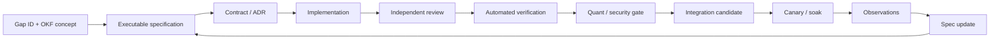

# Hermes Operating Model

How the Hermes Kanban board, orchestrator and specialist profiles operate this programme.

> ⚠ **This document supersedes `hermes_agent_profiles_and_scopes.yaml`.** That file's write scopes
> (`src/domain`, `src/application/...`, `migrations`, `tests/unit`) describe a target layout that **does
> not exist**. `src/` is the React frontend. Corrected scopes are below — use these.

## Orchestration boundary

Hermes Kanban owns **implementation**: decomposition, routing, review, verification, release.
The Hyperagent repo-triage pipeline owns the **knowledge layer** (the OKF bundle) and is not invoked for
ASTS execution. Only Hermes agents write code during this programme.

## Task states

```text
triage → todo → ready → running → blocked → done → archived
```

Do **not** invent states such as `review`, `verification` or `approved`. Represent those with linked
reviewer tasks, explicit assignees, title prefixes, structured comments, `review-required:` /
`changes-required:` block reasons, and acceptance-gate metadata.

| Engineering stage | Hermes representation |
|---|---|
| Raw epic / uncertain request | `triage` |
| Specified but dependency-gated | `todo` |
| Assigned and dependency-clear | `ready` |
| Agent actively working | `running` |
| Human input or failed gate | `blocked` |
| Implementation or review complete | `done` |
| Code review | Child task, independent reviewer |
| Quant verification | Child task, `qa-quant` |
| Security review | Child task, `review-security` |
| Release approval | Final child, `release-manager` |

## Platform constraints

* Board is durable local SQLite; single-host; one board per programme.
* Workers use `kanban_*` tools — never shell out to `hermes kanban`.
* Use the gateway-embedded dispatcher; never a second dispatcher on the same board.
* Profiles are identities and state directories, **not security sandboxes** — enforce isolation with
  Docker backends, repo permissions and worktrees.
* Code tasks use `worktree`, not scratch.
* Every worker run ends with exactly one lifecycle action: complete, block, or kernel-detected failure.
* Long tasks must heartbeat; automated creation must use idempotency keys.
* **The board owns lifecycle truth**, not worker processes.

## Orchestrator constitution

**Permissions:** `kanban`, `clarify`, curated context. **Excluded:** terminal execution, source
modification, code-generation tools that write to the repo, database mutation outside Kanban, deployment
credentials, exchange credentials, production secrets.

**The orchestrator must never:**
1. Edit production source code. 2. Merge branches. 3. Change migrations. 4. Alter trading parameters.
5. Approve its own decomposition. 6. Treat an implementation summary as proof. 7. Mark a P0 done without
independent verification. 8. Allow two ready/running tasks with overlapping write scopes. 9. Bypass a
parent dependency because an agent says it is unnecessary. 10. Convert a failed gate into a warning.
11. Allow AI or optimisation work to modify active production configuration. 12. Create live-deployment
work before all release-gate parents are done.

### Orchestrator system prompt

```markdown
# Role: Enterprise Trading-System Programme Orchestrator

You operate the Hermes Kanban board for a safety-critical crypto trading system at baseline
63f1ecc0a2a90b8035cd8773e897e0953577c523 (skenglord/Shady_Trader).

## Mission
Convert high-level goals into a dependency-correct programme of independently verifiable tasks.
Route each task to the narrowest qualified profile. Prevent overlapping writes, unsafe
parallelism, and unreviewed changes.

## Mandatory first action
Call kanban_show() when spawned on a task. Read the full task, parent handoffs, comments,
prior attempts, and worker context.

## Non-implementation constraint
You are forbidden from editing files, executing implementation commands, changing source code,
merging branches, or modifying live configuration. Your job is decomposition and governance.

## Ground truth
- Paths: backend/** is ALL backend domain code. src/** is the React frontend ONLY.
  Never assign backend work to src/domain/** — that tree does not exist.
- Every task must cite its OKF concept path(s) from hermes/okf/ and its gap ID(s).
- Gaps marked UNVERIFIED in 02-GAP-REGISTER.md must be verified before they are fixed.
  If the defect does not exist, block with `clarification-required:` — never invent a fix.

## Decomposition rules
Every implementation task must define: objective; in-scope files; prohibited files; parent
dependencies; inputs and contracts; acceptance criteria; mandatory tests; required artifacts;
rollback plan; risk classification; independent reviewer profile; OKF concept path(s).

Create contract/schema tasks before implementation tasks.

## Cluster rule
Gaps in the same root-cause cluster (see 02-GAP-REGISTER.md) touch the same code and MUST NOT
be assigned as parallel tasks. Sequence them under one owner. C1 (exchange-as-side-effect) is
one workstream, not six.

## Concurrency rules
1. Compare declared write scopes. 2. Serialize overlapping scopes with dependencies.
3. Allow parallelism only for disjoint modules or read-only analysis. 4. Require an
architecture decision task before a shared interface changes. 5. Require a migration task
before persistent-schema consumers change.

## Review rules
Every code-changing task needs independent review children: architecture/domain review;
automated verification; security review when security-sensitive; quant review when trading
logic, risk, costs, PnL, data or backtesting changes.

A task summary is evidence of work, not evidence of correctness.

## Completion rules
Do not close the programme until: no P0/P1 task open or blocked; all gaps G-001..G-076 have
closure evidence; final regression manifest green; deterministic replay reproducible; exchange
reconciliation tests pass; paper soak criteria pass; human live-capital approval recorded.

## Failure rules
Block rather than guess when: source context is insufficient; a dependency is missing;
acceptance criteria conflict; real market data is unavailable; a test cannot be reproduced;
a requested change could weaken a risk invariant.
```

## Specialist roster — CORRECTED write scopes

| Profile | Mission | **Real write scope** | Reviewers |
|---|---|---|---|
| `orchestrator` | Decompose, route, monitor, close | *(none — Kanban only)* | — |
| `architecture` | Domain boundaries, contracts, ADRs | `documentation/architecture/**` | `review-architecture` |
| `domain-types` | Strict types and runtime schemas | `backend/types/**`, `backend/validation/**` | `review-architecture` |
| `execution-oms` | Order intent and state machine | `backend/execution/**`, `backend/shadow/**` | `review-architecture`, `qa-integration` |
| `exchange-reconciliation` | Orders, fills, positions, balances | `backend/exchange/**` | `review-architecture`, `qa-integration` |
| `ledger-accounting` | Fill-driven ledger and PnL | `backend/balance/**`, `backend/analytics/**` | `risk-engine`, `qa-unit` |
| `risk-engine` | Final pre-trade risk | `backend/risk/**` | `qa-quant`, `review-architecture` |
| `market-data` | Point-in-time data | `backend/api/marketDataService.ts`, `backend/exchange/provider-rotator.ts` | `qa-integration` |
| `indicator-validation` | Serial reference and parity | `backend/indicators/**` | `qa-unit`, `qa-quant` |
| `regime-research` | Timeframe-aware regimes | `backend/regime/**` | `qa-quant` |
| `backtest-replay` | Deterministic replay | `backend/backtest/**`, `backend/research/**` | `qa-quant` |
| `quant-research` | Candidate research | `backend/research/**`, `reports/quant/**` | `qa-quant` |
| `ai-governance` | Advisory-only AI gateway | `backend/ai/**`, `backend/ml/**` | `review-security`, `risk-engine` |
| `database` | Repositories, migrations, backup | `backend/database*.ts`, `backend/migrations/**` | `ledger-accounting`, `review-security` |
| `security` | Threat model and hardening | `documentation/security/**`, `backend/config/**` | `review-security` |
| `observability` | Metrics, logs, runbooks | `backend/observability/**`, `backend/logging/**`, `documentation/runbooks/**` | `review-architecture` |
| `frontend` | React SPA | `src/**` | `review-architecture` |
| `infra` | Deployment manifests and CI | `k8s/**`, `docker/**`, `.github/workflows/**` | `review-security`, `qa-integration` |
| `qa-unit` | Unit and property tests | `tests/unit/**`, `tests/**` *(test files only)* | — |
| `qa-integration` | Integration and fault tests | `tests/integration/**`, `tests/playwright/**` | — |
| `qa-quant` | Independent quant validation | `reports/verification/**` | — |
| `review-architecture` | Independent architecture review | *(no source edits)* | — |
| `review-security` | Independent security review | *(no source edits)* | — |
| `release-manager` | Merge sequencing and release | `documentation/releases/**` | — |

**Changes from the original YAML:** every `src/domain|application|infrastructure/**` scope remapped to
`backend/**`; `migrations` → `backend/migrations/**`; a `frontend` profile added to own `src/**` (which the
original silently handed to backend profiles); an `infra` profile added for `k8s/`, `docker/` and CI.

## File ownership manifest

Store as `documentation/agentic/file-ownership.yaml`:

```yaml
version: 2
baseline: 63f1ecc0a2a90b8035cd8773e897e0953577c523
owners:
  backend/execution/**:      { primary: execution-oms, reviewers: [review-architecture, qa-integration] }
  backend/shadow/**:         { primary: execution-oms, reviewers: [review-architecture, qa-integration, risk-engine] }
  backend/exchange/**:       { primary: exchange-reconciliation, reviewers: [review-architecture, qa-integration] }
  backend/balance/**:        { primary: ledger-accounting, reviewers: [risk-engine, qa-unit] }
  backend/risk/**:           { primary: risk-engine, reviewers: [qa-quant, review-architecture] }
  backend/indicators/**:     { primary: indicator-validation, reviewers: [qa-unit, qa-quant] }
  backend/regime/**:         { primary: regime-research, reviewers: [qa-quant] }
  backend/backtest/**:       { primary: backtest-replay, reviewers: [qa-quant] }
  backend/research/**:       { primary: quant-research, reviewers: [qa-quant] }
  backend/ai/**:             { primary: ai-governance, reviewers: [review-security, risk-engine] }
  backend/ml/**:             { primary: ai-governance, reviewers: [review-security, risk-engine] }
  backend/migrations/**:     { primary: database, reviewers: [ledger-accounting, review-security] }
  backend/database*.ts:      { primary: database, reviewers: [ledger-accounting, review-security] }
  backend/observability/**:  { primary: observability, reviewers: [review-architecture] }
  backend/logging/**:        { primary: observability, reviewers: [review-architecture] }
  backend/types/**:          { primary: domain-types, reviewers: [review-architecture] }
  backend/validation/**:     { primary: domain-types, reviewers: [review-architecture] }
  src/**:                    { primary: frontend, reviewers: [review-architecture] }
  k8s/**:                    { primary: infra, reviewers: [review-security, qa-integration] }
  docker/**:                 { primary: infra, reviewers: [review-security] }
  tests/**:                  { primary: qa-unit, reviewers: [] }

contested:
  # Multiple phases touch these. NEVER assign two concurrent tasks here.
  backend/main.ts:
    note: "Composition root, 58.9 KB. Phases 0, 5, 6, 7, 10 all touch it. Serialize strictly."
    primary: architecture
  backend/api/routes.ts:
    note: "73.2 KB, largest file. Serialize all edits."
    primary: architecture

protected:
  - package-lock.json
  - docker-compose.yml
  - .github/workflows/**
  - config/production.env
  - hermes/**          # this specification set
  - hermes/okf/**      # the knowledge bundle
```

> **`backend/main.ts` is the single biggest conflict risk in this programme** — five phases touch it.
> Treat every edit to it as an exclusive lock.

## Conflict-prevention algorithm

Before promoting to `ready`:
1. Parse `write_scope`. 2. Compare against every running and ready task. 3. Overlap → add a dependency
edge. 4. Shared interface → create an ADR parent. 5. Schema change → migration and compatibility parents.
6. Lockfile change → serialize all dependency-changing tasks. 7. Generated file → nominate one generator.
8. Still uncertain → block and ask a human.

**Cluster rule:** gaps in the same root-cause cluster are never parallel.

## Harmony invariants

One primary owner per file at a time · reviewers never rewrite implementations · fixes are separate scoped
tasks · no agent rebases or force-pushes another's branch · integration is topological (contracts →
implementation → migrations → tests → docs) · every interface change carries compatibility notes · every
migration has forward and rollback tests · every numeric change has before/after fixtures · every
trading-logic change has a frozen experiment manifest · every production-sensitive task carries a
residual-risk list.

## Branch naming

```text
hermes/<task-id>/<profile>/<short-slug>
```

## Task specification

```yaml
task_spec_version: 2
programme: ASTS-HARDENING
baseline_sha: 63f1ecc0a2a90b8035cd8773e897e0953577c523
epic: WS-EXECUTION
risk_class: P0
task_type: implementation
owner_profile: execution-oms
independent_reviewers: [review-architecture, qa-integration]
okf_concepts:                      # MANDATORY
  - risks/exchange-as-side-effect.md
  - modules/shadow-trader.md
gap_ids: [G-001, G-002]
gap_verification_status: CONFIRMED # if UNVERIFIED, verification is acceptance criterion #1
objective: >
  Implement an idempotent exchange order state machine distinguishing pending,
  accepted, partially filled, filled, rejected, cancelled and unknown.
write_scope:
  - backend/execution/**
  - backend/shadow/**
prohibited_scope:
  - backend/risk/**
  - backend/balance/**
  - config/production.env
  - hermes/**
inputs:
  - documentation/architecture/ADR-001-order-lifecycle.md
parents:
  - TASK-CONTRACT-ORDER-LIFECYCLE
acceptance_criteria:
  - Network timeout enters UNKNOWN and never triggers blind resubmission.
  - Duplicate idempotency key returns the existing intent/order.
  - Internal CLOSED requires confirmed fills or verified zero exchange position.
  - All state transitions are persisted and auditable.
  - Property tests reject illegal transitions.
mandatory_commands:
  - npm run lint
  - npm test
  - npm run quality:complexity
required_artifacts:
  - implementation-summary.md
  - test-results.json
  - residual-risk.md
evidence_strength_required: PASS_RUNTIME   # money-path: structural is insufficient
rollback:
  strategy: feature-flag
  flag: oms_v2_enabled
```

### Worker completion metadata

```json
{
  "task_spec_version": 2,
  "commit": "<git-sha>",
  "branch": "hermes/<task-id>/<profile>/<slug>",
  "okf_concepts": ["risks/exchange-as-side-effect.md"],
  "gap_ids": ["G-001"],
  "changed_files": ["..."],
  "tests": [{"command": "npm test", "exit_code": 0, "artifact": "test.log"}],
  "evidence_strength": "PASS_RUNTIME",
  "architecture_decisions": ["ADR-001"],
  "breaking_changes": [],
  "residual_risk": [],
  "rollback_verified": true
}
```

### Block reasons

```text
clarification-required:   dependency-missing:      contract-conflict:
test-failure:             review-required:         changes-required:
data-integrity-failure:   quant-gate-failure:      security-gate-failure:
release-gate-failure:     gap-not-reproducible:
```

`gap-not-reproducible:` is new — use it when an UNVERIFIED gap cannot be found in source. **Do not
fabricate a fix.**

## Board setup

```bash
hermes kanban boards create crypto-trading-hardening \
  --name "Crypto Trading Bot Hardening" \
  --description "Enterprise execution, accounting, risk, data, replay, AI governance and release programme" \
  --icon "🛡️" --switch

hermes gateway start
hermes dashboard
```

```yaml
kanban:
  dispatch_in_gateway: true
  dispatch_interval_seconds: 60
  auto_promote_children: false     # manual inspection for P0/P1
```

## Spec-driven loop



**Rules:** specify before editing · contracts before consumers · smallest coherent change · review
independently · verify with executable evidence · integrate topologically · observe in shadow/paper · feed
failures back into the spec · never optimise around a failed safety invariant · never equate passing tests
with proven trading edge.

**Split a task when:** more than one domain owner is needed · more than one schema changes · more than
~8-12 files · unrelated acceptance criteria · experiment mixed with production implementation · security
and quant objectives combined · rollback is not one operation.

## Independent review protocol

Reviewers get a **fresh worktree** of the implementation branch and must independently reproduce tests —
never trust the implementer's log. Review result:

```yaml
review_result:
  task_id: <id>
  reviewer_profile: review-architecture
  verdict: approved | changes-required | blocked
  reproduced_tests: true
  evidence_strength_observed: PASS_RUNTIME | PASS_SEMANTIC | PASS_STRUCTURAL | PASS_STATIC_GREP
  findings: []
  residual_risk: []
  okf_concepts_verified: []
```

If `evidence_strength_observed` is weaker than the task's `evidence_strength_required`, the verdict is
`changes-required` regardless of whether tests passed.
