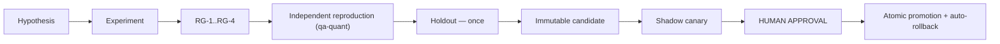

# Quantitative Research Protocol

## Critical evidence boundary

Two distinct classes — never conflate them:

1. **Evidence-supported design candidates** — supported by published empirical work on real crypto data
   (cost-aware filtering, walk-forward validation, volatility-aware sizing, trend-following asymmetry).
2. **Bot-approved production parameters** — values that have passed *this project's* deterministic replay,
   walk-forward, cost stress, Monte Carlo, paper trading and release gates.

> **No parameter becomes a production default because a paper reported good results.** Published results
> are prior evidence, not a substitute for independent reproduction on this system's own data, costs,
> latency and execution model.

## Prerequisite

**Quant work cannot start until deterministic replay exists** (Phase 8). Research on a backtester that
does not share the production decision/execution/ledger path measures a different system. See
[`backtest-not-production-equivalent`](okf/risks/backtest-not-production-equivalent.md).

Also blocking: G-016 (starved history) and G-022 (uncalibrated confidence) — research on 150 candles with
constant "confidence" cannot produce a trustworthy result.

## Data

* Exchange-native OHLCV at the trading timeframe **plus** a lower timeframe for intrabar path modelling.
* Funding-rate history for perpetuals.
* Order-book snapshots or spread estimates for slippage calibration.
* **Point-in-time discipline:** never use a value that was not observable at decision time. Provenance and
  as-of timestamps recorded per series.

## Universe and timeframes

Start with liquid majors. Justify each addition — a thin-liquidity symbol changes the cost model and
invalidates shared assumptions. Declare the primary timeframe and the intrabar timeframe explicitly; the
timeframe registry (Phase 6) is the single source.

## Time splits

```text
|<--- in-sample --->|<--- out-of-sample --->|<--- FROZEN holdout --->|
        train                validate              touched ONCE
```

* Walk-forward with rolling or anchored windows; honour a minimum out-of-sample size.
* **The holdout is touched exactly once**, at the end. If you look at it twice, it is no longer a holdout
  and the result is invalid.
* Minimum sample policy: a seven-day window overfits (G-052) and must not justify a parameter.

## Execution semantics

* Close-based signals execute at the **next eligible event** — never the decision candle (G-046).
* Stop/target ordering within a bar resolved by lower-timeframe data or a declared OHLC path model.
* Explicit latency assumption.
* Partial fills, minimum notional, lot and tick rounding all modelled.

## Cost matrix

| Component | Requirement |
|---|---|
| Maker/taker fees | Per venue, actual tier |
| Spread | Measured, not assumed |
| Slippage | Size-dependent, calibrated to book depth |
| Funding | Actual historical rates for perpetuals |
| Latency | Explicit, applied to fill price |

**Cost stress is mandatory:** re-run at 1×, 2× and 3× the cost matrix. A strategy that dies at 2× cost is
not robust — it is a cost-model artifact.

## Statistical integrity

| Test | Purpose |
|---|---|
| **DSR** (Deflated Sharpe Ratio) | Correct for selection bias and non-normality |
| **PBO** (Probability of Backtest Overfitting) | Estimate overfit likelihood across trials |
| **Reality Check / SPA** | Guard against data snooping across many rules |
| Monte Carlo resampling | Distribution of outcomes, not one path |
| Parameter stability | Neighbouring parameters should behave similarly |

**Report every trial, not just winners.** Trial count is an input to DSR and PBO — hiding failures
mechanically inflates both. A trial score persisted as zero (G-050) corrupts this entirely.

**Parameter-stability heuristic:** a lone sharp peak surrounded by poor neighbours is overfit. Prefer a
broad plateau, even at lower headline performance.

## Objective function

```text
maximise:  risk_adjusted_return
subject to:
  max_drawdown      ≤ mode_limit
  turnover          ≤ cost_budget
  min_trade_count   ≥ statistical_significance_floor
  tail_risk (CVaR)  ≤ limit
  parameter_stability_score ≥ threshold
```

Never optimise raw return. Unconstrained return maximisation selects for tail risk and turnover.

## Experiment manifest

Every run emits a manifest making it byte-reproducible:

```yaml
experiment:
  id: <uuid>
  timestamp: <iso8601>
  hypothesis: "<one sentence, stated BEFORE the run>"
  candidate_family: <cost_filter|vol_sizing|trend_asymmetry|...>
  code_commit: <sha>
  replay_engine_version: <version>
data:
  symbols: []
  timeframe: <tf>
  intrabar_timeframe: <tf>
  range: {start: <iso>, end: <iso>}
  checksums: {<symbol>: <sha256>}
splits:
  in_sample: {start, end}
  out_of_sample: {start, end}
  holdout: {start, end, touched: false}
costs:
  fee_maker: <frac>
  fee_taker: <frac>
  spread_model: <desc>
  slippage_model: <desc>
  funding: historical
  stress_multipliers: [1.0, 2.0, 3.0]
parameters: {}
results:
  trials_total: <int>          # ALL trials, including failures
  sharpe: <float>
  dsr: <float>
  pbo: <float>
  max_drawdown: <float>
  cvar_95: <float>
  turnover: <float>
  trade_count: <int>
  cost_attribution: {}
  confidence_intervals: {}
verdict: promote_candidate | reject | inconclusive
```

## Research gates

* **RG-1** Reproducible: re-running the manifest produces identical results.
* **RG-2** Cost-robust: survives 2× cost stress.
* **RG-3** Statistically sound: DSR positive after trial-count correction; PBO below threshold.
* **RG-4** Stable: performance is a plateau, not a spike.
* **RG-5** Independently reproduced by `qa-quant` from the manifest alone.
* **RG-6** Holdout confirms — evaluated once, at the end.

Failing any gate → `quant-gate-failure:`. **No candidate is promoted directly to production.**

## Promotion workflow



## Agent prompts

**`quant-research`:** Establish the current-strategy baseline first — no candidate is evaluated without
one. Test **one candidate family at a time**. Freeze the holdout. Report all trials including failures.
Never write to `config/production*`. Never promote a candidate yourself. If real market data is
unavailable, block with `data-integrity-failure:` rather than substituting synthetic data.

**`qa-quant`:** Reproduce from the manifest alone — never from the researcher's notebook or summary. Hunt
look-ahead: check that every feature was observable at decision time, that execution is next-event, and
that holdout was touched once. Recompute DSR/PBO independently using the **full** trial count. Verify the
cost matrix matches venue reality. Approve only what you reproduced yourself; a summary is evidence of
work, not of correctness.

## Reference evidence

Prior evidence only — each requires independent reproduction on this system.

* Bysik & Ślepaczuk (2026), *ML-Based Bitcoin Trading Under Transaction Costs*, arXiv:2606.00060
* Mroziewicz & Ślepaczuk (2026), *Double Out-of-Sample and Walk-Forward Optimisation*, arXiv:2602.10785
* Bui & Nguyen (2026), *Systematic Trend-Following with Adaptive Portfolio Construction*, arXiv:2602.11708 — preprint
* Rozario et al. (2020), *A Decade of Trend Following in Cryptocurrencies*, arXiv:2009.12155
* Bailey & López de Prado (2014), *The Deflated Sharpe Ratio*, DOI 10.3905/jpm.2014.40.5.094
* Bailey, Borwein, López de Prado & Zhu, *The Probability of Backtest Overfitting*
* White (2000), *A Reality Check for Data Snooping*, DOI 10.1111/1468-0262.00152
* Sullivan, Timmermann & White (1999), *Data-Snooping and the Bootstrap*, DOI 10.1111/0022-1082.00163
