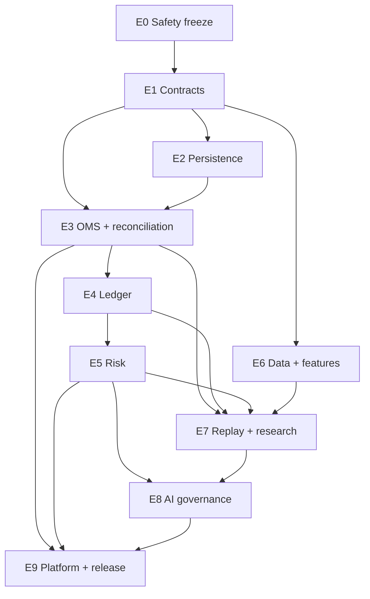
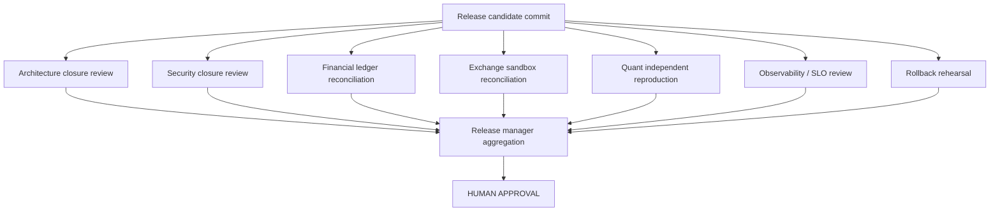

# Epics and Orchestrator Runbook

## Epic roster

Each epic maps to phases in [`04-IMPLEMENTATION-PLAN.md`](04-IMPLEMENTATION-PLAN.md), names **real** write
paths, and cites OKF concepts.

### E0 — Safety freeze
**Owner:** `security` · **Reviewers:** `review-security`, `qa-integration` · **Phase:** 0
**Paths:** `backend/main.ts`, `backend/ml/`, `backend/optimization/`, `.github/workflows/`
**Gaps:** G-007, G-009, G-012, G-013, G-076
**OKF:** [`simulated-capital-sizing`](okf/risks/simulated-capital-sizing.md), [`startup-state-destruction`](okf/risks/startup-state-destruction.md), [`ci-red-on-main`](okf/risks/ci-red-on-main.md)

Deliver: live submit disabled by default · AI mode switching disabled · optimiser promotion disabled ·
Degen override disabled · full-balance auto-allocation removed (`main.ts:697-700`) · startup reset removed
(`main.ts:692`) · explicit `liveArmed` state · transaction-safe backup · **G-076 CI triage**.

### E1 — Contracts and state machines
**Owners:** `architecture` → `domain-types` · **Phase:** 1 · **Paths:** `documentation/architecture/`, `backend/types/`, `backend/validation/`
**Gaps:** G-030, G-063

Deliver: ADRs for order lifecycle, ledger authority, config authority, reconciliation truth · strict domain
types · runtime schemas · unit-safe `Percent`/`Fraction` (kills the G-030 class) · contract-specific PnL
function signatures.

### E2 — Persistence
**Owner:** `database` · **Phase:** 2 · **Paths:** `backend/database*.ts`, `backend/migrations/`
**Gaps:** G-037…G-040, G-059, G-061 · **OKF:** [`database-abstraction-leak`](okf/risks/database-abstraction-leak.md)

Deliver: **Postgres placeholder resolution or formal deprecation** · typed repositories · automated
placeholder tests · config version table · immutable audit/event tables · WAL-safe backup.

### E3 — OMS and reconciliation
**Owners:** `execution-oms`, `exchange-reconciliation` · **Phase:** 3 · **Paths:** `backend/execution/`, `backend/shadow/`, `backend/exchange/`
**Gaps:** G-001, G-002, G-003, G-014, G-015, G-027, G-029, G-068 · **OKF:** [`exchange-as-side-effect`](okf/risks/exchange-as-side-effect.md), [`no-reconciliation-loop`](okf/risks/no-reconciliation-loop.md)

Deliver: idempotent intent · full order state machine with `UNKNOWN` · unknown-state reconciliation · fill
stream · reduce-only exits · startup and continuous reconciliation (**wire the existing engine**) ·
per-symbol price routing.

> **Cluster C1 — sequence strictly under one owner.** All of these touch `shadow_trader.ts`.

### E4 — Ledger and capital
**Owner:** `ledger-accounting` · **Phase:** 4 · **Paths:** `backend/balance/`, new ledger module
**Gaps:** G-004, G-028, G-029, G-035, G-036 · **OKF:** [`leveraged-pnl-inversion`](okf/risks/leveraged-pnl-inversion.md)

Deliver: double-entry journal · **corrected PnL formula** · reservations · realised/unrealised PnL ·
fees/funding · high-water and daily equity · transfer controls · leveraged fixtures.

### E5 — Risk
**Owner:** `risk-engine` · **Phase:** 5 · **Paths:** `backend/risk/`
**Gaps:** G-006, G-010, G-031…G-036, G-041 · **OKF:** [`final-risk-gate-missing`](okf/risks/final-risk-gate-missing.md)

Deliver: final risk gate with stored `RiskDecision` · cost/liquidity inputs · exposure and correlation caps
· drawdown throttle from high-water · **real daily-loss computation** · loss-streak halt · zero floor on
negative Kelly · persisted risk state.

### E6 — Market data and features
**Owners:** `market-data` → `indicator-validation` → `regime-research` · **Phase:** 6 · **Paths:** `backend/indicators/`, `backend/regime/`, `backend/exchange/connector.ts`
**Gaps:** G-016…G-024, G-053 · **OKF:** [`starved-history`](okf/risks/starved-history.md), [`parallel-indicator-pipeline`](okf/risks/parallel-indicator-pipeline.md)

Deliver: timeframe registry · complete history · data-quality flags · serial reference · **worker parity
assertion** · regime calibration · hysteresis.

> **Strictly ordered:** G-016 before G-021/G-022.

### E7 — Replay and research
**Owners:** `backtest-replay`, `quant-research` · **Phases:** 7-8 · **Paths:** `backend/backtest/`, `backend/research/`
**Gaps:** G-025, G-026, G-046…G-052

Deliver: exact-once cycle · production-equivalent replay · cost/funding/fill models · experiment registry ·
DSR/PBO · holdout reports.

### E8 — AI governance
**Owner:** `ai-governance` · **Phase:** 9 · **Paths:** `backend/ai/`, `backend/ml/`
**Gaps:** G-012, G-047, G-073 · **OKF:** [`ai-unbounded-authority`](okf/risks/ai-unbounded-authority.md)

Deliver: advisory-only gateway · model/prompt versioning · output schema · deterministic policy boundary ·
no risk increase or Degen selection · historical-context discipline.

### E9 — Platform and release
**Owners:** `observability`, `qa-integration`, `release-manager` · **Phases:** 10-11
**Paths:** `backend/observability/`, `backend/logging/`, `k8s/`, `documentation/runbooks/`
**Gaps:** G-043…G-045, G-064…G-071

Deliver: readiness state machine · in-flight registry · ordered shutdown · metrics/alerts/runbooks · fault
suite · soak report · canary · rollback package · **credential rotation**.

## Dependency graph



## Recommended epic tasks

| Epic task | Assignee | Priority | Parent |
|---|---|---:|---|
| Freeze live activation and capital mutation | `security` | 0 | programme root |
| Triage red CI (G-076) | `infra` | 0 | programme root |
| Define unit-safe domain contracts | `domain-types` | 0 | freeze |
| Define order lifecycle ADR | `architecture` | 0 | domain contracts |
| Resolve Postgres placeholder defect | `database` | 0 | domain contracts |
| Implement OMS state machine | `execution-oms` | 0 | order ADR + persistence |
| Wire exchange reconciliation | `exchange-reconciliation` | 0 | OMS |
| Implement fill-driven ledger | `ledger-accounting` | 0 | OMS + reconciliation |
| Implement final risk gate | `risk-engine` | 0 | ledger |
| Timeframe registry + complete history | `market-data` | 1 | domain contracts |
| Indicator serial/parallel parity | `indicator-validation` | 1 | market data |
| Calibrate regime detector | `regime-research` | 1 | indicators |
| Build deterministic replay | `backtest-replay` | 1 | OMS + ledger + risk + data |
| Evidence-grounded quant programme | `quant-research` | 1 | replay |
| Enforce advisory-only AI | `ai-governance` | 1 | risk + quant |
| Observability and runbooks | `observability` | 1 | execution + ledger + risk |
| Full fault-injection suite | `qa-integration` | 1 | implementation epics |
| Independent quantitative audit | `qa-quant` | 1 | quant programme |
| Rotate exposed credentials | `security` | 0 | *(operator action)* |
| Shadow and paper soak | `release-manager` | 1 | all gates |
| Minimal live canary approval | `release-manager` | 0 | soak + **human approval** |

## Orchestrator runbook

### Step 1 — Establish baseline
Record `main` at `63f1ecc0a2a90b8035cd8773e897e0953577c523` · record migrations and lockfiles · record env var **names** only, never values ·
run existing tests and **record the known-red CI state (G-076)** · export current shadow/open-trade state ·
manually reconcile any real exchange state · create a read-only baseline tag.

### Step 2 — Initialise Hermes
Create profiles with the **corrected** scopes from
[`06-HERMES-OPERATING-MODEL.md`](06-HERMES-OPERATING-MODEL.md) · set each profile's absolute
`terminal.cwd` · configure toolsets and Docker isolation · create the board · start the gateway dispatcher
· open the dashboard · keep `auto_promote_children=false` for P0/P1.

### Step 3 — Seed the programme root
Create the root triage goal · attach this `hermes/` directory **and** the OKF bundle · have the
orchestrator decompose only the first two layers · review child scopes before promotion · verify every P0
task has review and verification children **and cites an OKF concept path**.

### Step 4 — Freeze unsafe behaviour
Run E0 first. Do not run live execution, optimiser promotion or AI mode switching while the programme is
active.

### Step 5 — Contracts first
Create and approve ADRs and domain schemas before parallel implementation. This is what prevents
independently plausible but incompatible agent output.

### Step 6 — Controlled parallelism
Parallel only when write scopes are disjoint:
* OMS and market-data contracts may proceed separately.
* Ledger waits for OMS fill contracts.
* Risk waits for ledger equity/reservation contracts.
* Replay waits for OMS, ledger, risk and data.
* Quant waits for deterministic replay.
* AI governance waits for risk policy and quant evidence.

**Never parallelise within a root-cause cluster.** **`backend/main.ts` requires an exclusive lock** — five
phases touch it.

### Step 7 — Continuous review
For each implementation: generate review child · generate verification child · independently reproduce
tests · create scoped fix tasks for failures · **never let the implementer approve itself**.

### Step 8 — Quantitative loop
Baseline first · cost and leakage checks · one candidate family at a time · frozen holdout · all trials
reported · accepted candidates go to independent verification. No candidate promoted directly.

### Step 9 — Integration
Release manager merges topologically into an integration branch. After each merge group: full regression ·
migration tests · reconciliation fixtures · deterministic replay checksum · update the gap-closure matrix.

### Step 10 — Soak
Shadow and paper with production-quality data and exchange sandbox quotes. **Live submission stays
disarmed.**

### Step 11 — Final verification
Release manager reproduces final evidence and verifies board and gap closure. The human owner decides on a
minimal-capital canary.

### Step 12 — Canary and rollback
Explicit capital ceiling · one exchange · one or few liquid symbols · conservative mode · no AI risk
increases · automatic halt on reconciliation mismatch · predefined rollback and flatten policy.

## Completion verification



### Final evidence

```yaml
release_candidate:
  commit: <sha>
  baseline: 63f1ecc0a2a90b8035cd8773e897e0953577c523
  config_version: <uuid>
  strategy_version: <version>
  model_versions: []
  database_migration: <version>
closure:
  gaps_total: 76
  gaps_closed: <n>
  gaps_verified_before_close: <n>     # UNVERIFIED gaps must be verified, not assumed
  p0_open: 0
  p1_open: 0
  blocked_tasks: 0
verification:
  typecheck: pass
  lint: pass
  unit: pass
  property: pass
  integration: pass
  fault_injection: pass
  ledger_reconciliation: pass
  exchange_reconciliation: pass
  deterministic_replay: pass
  quant_independent_reproduction: pass
  security: pass
  rollback_rehearsal: pass
  ci_green_on_main: pass              # G-076
runtime:
  paper_soak_days: 30
  orphaned_positions: 0
  unprotected_positions: 0
  duplicate_intents: 0
  unresolved_reconciliation_mismatches: 0
operator_actions:
  credentials_rotated: true           # the four pre-baseline secrets
  history_rewrite_completed: <bool>
approval:
  live_armed: false
  human_approval_required: true
```

### Closure matrix

One row per gap. **Note:** the original specification's template row reused the literal ID `G-001`, which
made naive parsers see a duplicate. Use a placeholder token instead:

```text
| gap_id | task_ids | commit_sha | evidence_artifact | verification_task | evidence_strength | status |
|--------|----------|------------|-------------------|-------------------|-------------------|--------|
| <GAP>  | <TASKS>  | <SHA>      | <ARTIFACT>        | <TASK>            | PASS_RUNTIME      | closed |
```

Status vocabulary: `closed` · `closed_verified` · `not_reproducible` (UNVERIFIED gap that did not exist —
legitimate closure with evidence) · `deferred` (with an accepted-risk note and human sign-off).

## Expected end state

A Hermes-managed, durable, auditable workflow · explicit contracts preventing semantic drift · isolated
worktrees and non-overlapping ownership · independent architecture, security, integration and quant
verification · a reconciled order and position lifecycle · fill-driven accounting and real free-collateral
sizing · complete timeframe-aware data and deterministic features · production-equivalent replay ·
evidence-grounded candidates · no automatic AI or optimiser authority over capital · versioned, approved,
reversible configuration · observable safety invariants and tested rollback · **humans retaining
live-capital authority**.

> The outcome is not "more agents writing code." It is a controlled engineering organisation encoded in
> durable tasks, contracts, evidence and gates. Unmanaged parallel agents create code quickly; governed
> agents create a system that can be trusted with money.
